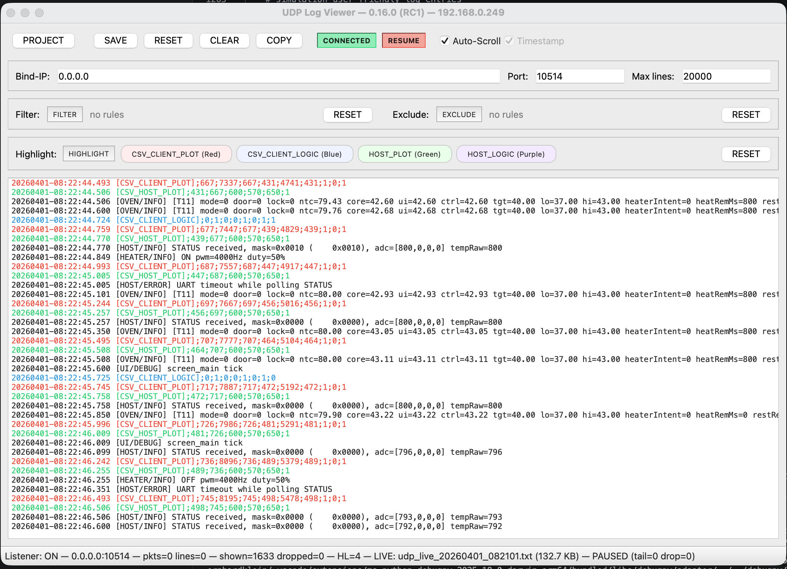
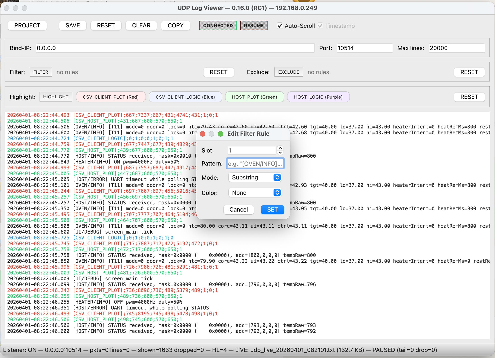
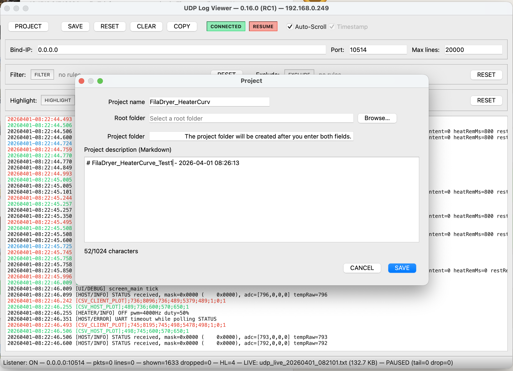
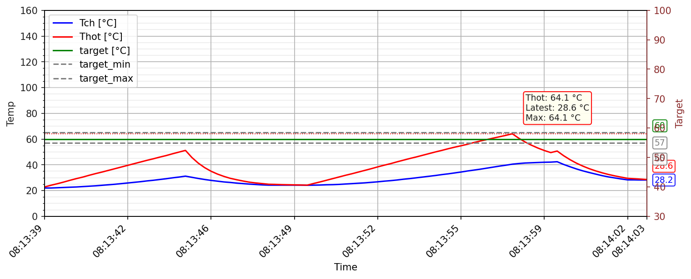
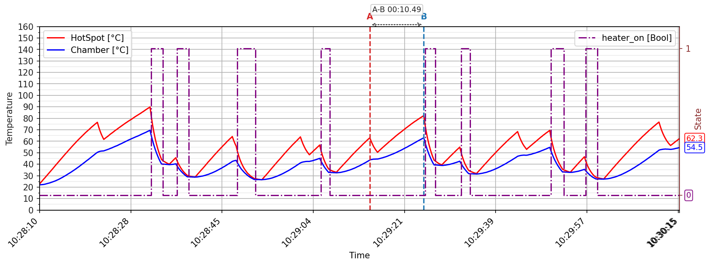
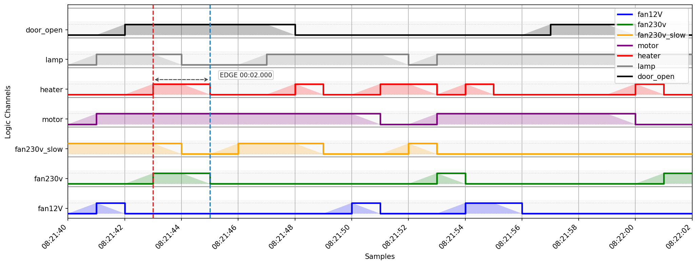
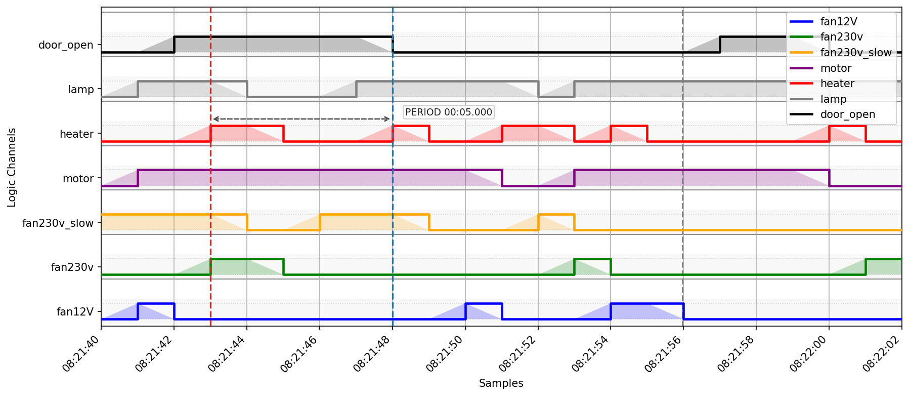

# UDP Log Viewer

Plattformübergreifender UDP Log Viewer für ESP32 und andere Embedded-Systeme, entwickelt mit Python und PyQt5.

## Warum dieses Tool?

Das Debuggen von Embedded-Systemen über UDP ist mühsam.
Dieses Tool macht es einfacher und visueller. Es zeigt Daten nicht nur an, sondern visualisiert sie auch.

## Dokumentation

Vollständige deutsche Dokumentation:

- [docs/DOKUMENTATION_de.md](docs/DOKUMENTATION_de.md)
- [docs/USER_GUIDE_de.md](docs/USER_GUIDE_de.md)
- [docs/RELEASE_0.16.2_de.md](docs/RELEASE_0.16.2_de.md)

Vollständige englische Dokumentation:

- [docs/DOCUMENTATION_en.md](docs/DOCUMENTATION_en.md)
- [docs/USER_GUIDE_en.md](docs/USER_GUIDE_en.md)
- [docs/RELEASE_0.16.2.md](docs/RELEASE_0.16.2.md)

## Demo-Projekt zur UDP-Nutzung auf ESP32

Ein passendes Demo-Projekt gibt es hier:
https://github.com/mrRobot62/esp-udp-logging.git

## Windows-Nutzer

Bitte die `setup.exe` zur Installation des Viewers verwenden.

## Nur für macOS-Nutzer

Nach der Installation ist die Anwendung nicht signiert und kann nicht direkt gestartet werden.
Bitte diesen Befehl ausführen: `xattr -dr com.apple.quarantine /Applications/UDPLogViewer.app`

## Screenshots

Die Screenshot-Assets liegen unter [assets/screenshots](assets/screenshots).

### Hauptansicht



### Regel-Konfiguration



### Projekt-Dialog



### Plot-Visualizer mit Tooltip

**Zeitbasierte Visualisierung**


**Zeitmessung**



### Logic-Messung

**HIGH/LOW-Phase messen**


**Signalperiode messen**


## Aktueller Umfang

Die aktuelle Codebasis enthält:

- Echtzeit-UDP-Logempfang
- Filter-, Exclude- und Highlight-Regeln
- Live-Session-Logging
- `RESET` im Hauptfenster für einen frischen Log-Start innerhalb derselben App-Session
- Laufzeit-Projektkontexte zum Gruppieren von Logs und Screenshots pro Testsession
- Projektbeschreibungen als `README_<projectname>.md` direkt im Projektordner
- Replay gespeicherter Logdateien
- integrierte Simulation für Text-, Temperatur- und Logic-Traffic
- CSV-basierte Datenvisualisierung
- Logic-Kanal-Visualisierung
- Flanken- und Periodenmessung direkt im Logic-Graphen
- Laufzeit-`Legend`-Umschaltung in Plot- und Logic-Fenstern
- tastaturgesteuerte Screenshot-/Save-Kürzel und explizite `TAB`-Navigation im Haupt- und in den Graph-Fenstern
- Packaging-Skripte für macOS und Windows

## Start aus dem Quellcode

```bash
python -m venv venv
source venv/bin/activate
pip install -e .[dev]
udp-log-viewer
```

## Entwickler-Bootstrap

```bash
./scripts/bootstrap_macos_linux.sh
```

# Gefällt dir das Projekt?

⭐ Wenn dir das Projekt gefällt, gib ihm gerne einen Star!
