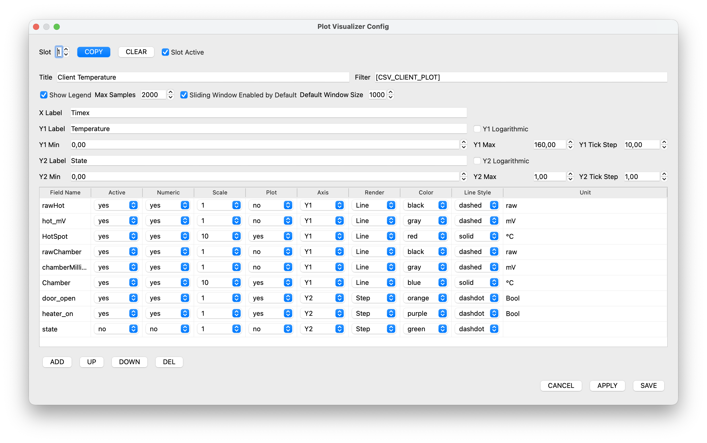
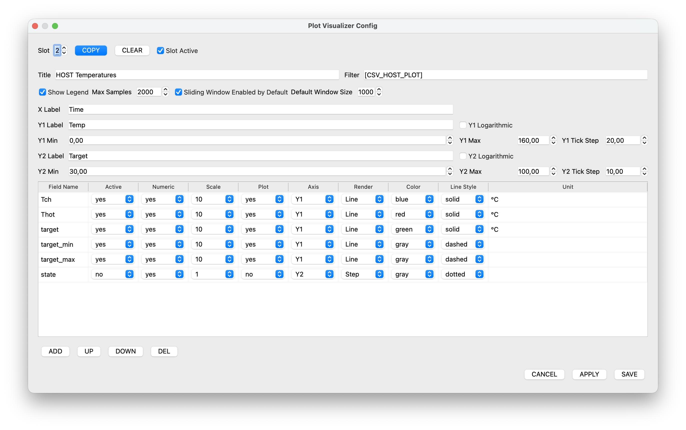
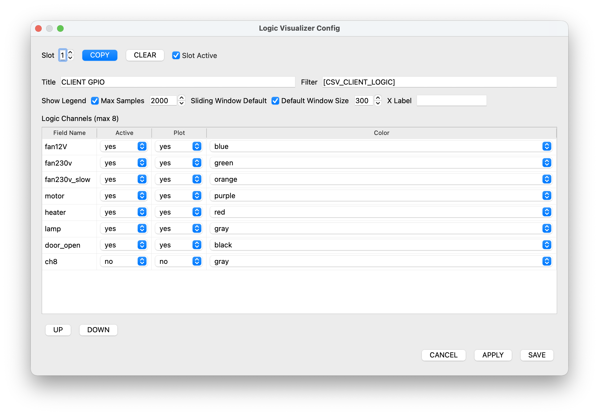
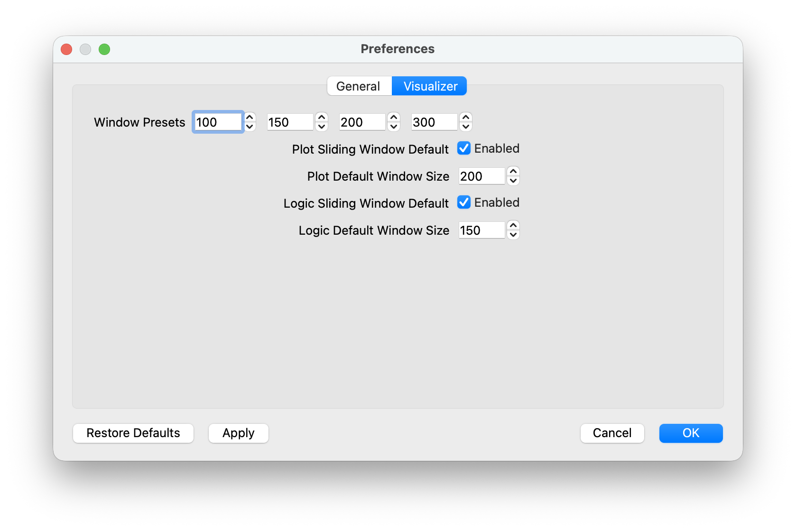

# UDP Viewer Scenario Figures

This document centralizes the screenshots referenced by
[SCENARIOS_en.md](SCENARIOS_en.md). All links are relative so they work
both in the local repository and in the remote repository.

## Figure 1 Main Window Overview

Overview of the main window with active connection, visible rule chips,
and the primary control row.

## Figure 2 Rule Configuration

Example of slot-based rule configuration for filtering, excluding, and
highlighting incoming log lines.

## Figure 3 Project Dialog

Project dialog with project name, root folder, and Markdown project
description.

## Figure 4 Plot Visualizer Configuration

Example of the plot visualizer configuration dialog for CSV-based
telemetry.

## Figure 5 Plot Visualizer Detail

Additional plot visualizer configuration with field and axis settings.

## Figure 6 Plot Visualizer Tooltip

Plot visualizer with tooltip and value inspection on a graph.

## Figure 7 Logic Visualizer Configuration

Logic visualizer configuration dialog for state-based CSV data.

## Figure 8 Logic Visualizer Measurement

Logic visualizer with an active timing measurement between two states.

## Figure 9 Preferences General

General preferences dialog with default language, log path, and UI
settings.

## Figure 10 Preferences Visualizer

Visualizer-related defaults such as presets and default window sizes.

