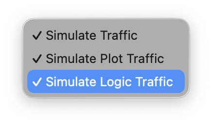
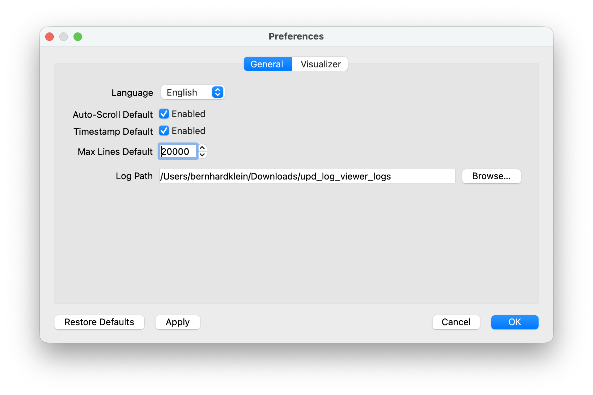

# UDP Viewer User Guide

This document describes the visible usage of UDP Viewer from an end-user perspective. It is intentionally workflow-oriented and complements the technical references for configuration, CSV input formats, and build/packaging.

For scenario-based examples with realistic IoT and diagnostics use
cases, see:

- [UDP Viewer Scenarios](SCENARIOS_en.md)
- [Scenario Figures](SCENARIO_IMAGES_en.md)

## 1. What the Application Is For

UDP Viewer is used to receive UDP-based text and telemetry data, display it, filter it, highlight it with colors, persist it locally, and visualize structured values in graphs.

Typical use cases:

- real-time monitoring of embedded logs
- filtering relevant messages during development
- highlighting errors or state patterns
- replaying previously saved logs
- simulating typical traffic without a live sender
- visualizing structured CSV-like telemetry

## 2. Main Window Overview

The main interface consists primarily of:

- action row with `SAVE`, `RESET`, `CLEAR`, `COPY`, `CONNECT`, `PAUSE`
- options for `Auto-Scroll` and `Timestamp`
- input fields for `Bind-IP`, `Port`, and `Max lines`
- areas for `Filter`, `Exclude`, and `Highlight`
- main log view
- menu bar with `File`, `Tools`, and `Visualize`

## 3. First Start and Basic Connection Flow

### 3.1 Bind IP and Port

Before starting UDP reception, the usual fields are:

- `Bind-IP`
- `Port`

Typical variants:

- `0.0.0.0`
  listens on all local interfaces
- a specific local IP
  listens only on that interface

### 3.2 Start a Connection

To begin receiving data:

1. enter `Bind-IP` and `Port`, or keep the existing values
2. press `CONNECT`

Expected behavior:

- the button switches into the connected state
- a live log file is prepared for the current session
- incoming UDP lines appear in the main view
- the status bar reflects the active state

### 3.3 Stop a Connection

To disconnect:

1. press `CONNECT` again
2. confirm the save dialog if it appears

Expected behavior:

- the listener is stopped
- the application returns to the disconnected state
- the last session can still be saved

### 3.4 Exit behavior with active live data

When the application is closed while it is still connected and the
current session has already received log lines, a confirmation dialog is
shown.

Choices:

- `Save…`
  opens the normal save dialog before exit
- `No`
  closes the application without exporting an extra copy
- `Cancel`
  keeps the application open

## 4. Working During a Live Session

### 4.1 `PAUSE`

`PAUSE` stops the visible log view from continuously updating.

In practice:

- you can freeze a running view for inspection
- when pause is released, the display continues again
- buffer handling is managed internally and does not normally require user action

### 4.2 `Auto-Scroll`

If `Auto-Scroll` is enabled:

- the main view jumps to the end when new lines arrive

If `Auto-Scroll` is disabled:

- the current scroll position is preserved

This is useful when you need to inspect older log regions without new data pulling the view away.

### 4.3 `Timestamp`

If `Timestamp` is enabled:

- the application adds local timestamps to displayed output

Important:

- this is a viewer-side display option
- depending on the workflow, the change may apply on the next `CONNECT`

### 4.4 `Max lines`

This field limits the number of visible lines kept in the main view.

Practical benefit:

- prevents unbounded visible buffer growth
- helps keep the GUI responsive during longer sessions

## 5. Working With Logs

### 5.1 `SAVE`

`SAVE` stores the current or last session.

At the current behavior, the application prefers:

- the underlying live session log file

If no suitable backing file is available:

- it falls back to the currently visible text content

### 5.2 `CLEAR`

`CLEAR` empties the visible main log view.

This is mainly useful to:

- reset the display for a new observation phase
- inspect the effect of active filters or highlights more clearly

### 5.3 `RESET`

`RESET` starts a new log phase inside the same application session.

At the current behavior it:

- clears the visible main log view
- resets in-memory buffers and counters
- switches `CONNECT` back to `OFF`
- closes the current live log cleanly
- immediately prepares a new live log file with a fresh timestamp
- resets the active `PROJECT` context back to the default state

This is useful to:

- begin a new test phase without restarting the application
- generate a fresh log file with a clean beginning
- start the next project flow from a clean default state

### 5.4 `COPY`

`COPY` copies the visible content of the main log view to the clipboard.

### 5.5 Keyboard use in the main window

The main window provides explicit keyboard navigation via `TAB` and
`Shift` + `TAB`.

This allows direct keyboard focus traversal across controls such as:

- `PROJECT`
- `SAVE`
- `RESET`
- `CLEAR`
- `COPY`
- `CONNECT`
- `PAUSE`
- the `Bind-IP`, `Port`, and `Max lines` input fields

Additional save shortcuts:

- `Ctrl` + `S`
- `Cmd` + `S`
- `F12`

### 5.6 `PROJECT`

The `PROJECT` dialog now also contains a multi-line Markdown
description.

Behavior:

- when a project is created or saved, a file
  `README_<projectname>.md` is written into the project folder
- the default content starts with a heading containing the project name
  and the current timestamp
- the description is limited to `1024` characters
- allowed project-name characters are `A-Za-z`, `0-9`, `_`, and `-`
- `NEW` resets the dialog to an empty project name, the default root
  folder, and the default README text

## 6. Filter, Exclude, and Highlight

The application provides slot-based rules for:

- `Filter`
- `Exclude`
- `Highlight`

Each area can contain multiple rules, shown as visible chips.

### 6.1 Filter

Filter rules reduce the visible output to matching lines.

Typical use:

- show only one subsystem
- watch only specific tags or states

If no filter rules are active:

- all otherwise accepted lines are shown

### 6.2 Exclude

Exclude rules suppress unwanted messages.

Typical use:

- hide periodic status traffic
- remove known noisy repetitions from the main view

### 6.3 Highlight

Highlight rules colorize matching lines in the display.

Typical use:

- mark errors in red
- emphasize specific states or subsystems

### 6.4 Creating and Editing Rules

The typical workflow is similar across all three areas:

1. press the corresponding button such as `FILTER`, `EXCLUDE`, or `HIGHLIGHT`
2. enter the pattern and mode
3. choose a color if applicable
4. confirm the rule

Existing chips can then be edited or removed.

### 6.5 Reset

`RESET` in the rules area clears the active rule state again.

## 7. Replay of Saved Log Files

The application can replay an existing log file.

Typical workflow:

1. `File -> Open Log…`
2. select a text file
3. replay starts and injects the lines into the same internal processing path used for live data

Additional menu items exist for:

- `Replay Sample`
- `Stop Replay`

Practical uses:

- reproduce a problem pattern
- test filter or highlight rules without a live sender
- verify visualizer behavior on known input files

## 8. Simulation

The `Tools` menu contains built-in simulation paths.

Currently available:

- `Simulate Traffic`
- `Simulate Temperature Traffic`
- `Simulate Logic Traffic`

These are useful when:

- no live sender is currently available
- UI behavior needs to be checked
- visualizer windows should be driven from synthetic data

At the current behavior, some simulation flows require an active connection.

## 9. Using the Visualizers

The `Visualize` menu contains the visualizer functionality.

Currently relevant:

- temperature visualizer
- logic visualizer

Typical workflow:

1. open the visualizer configuration
2. select the desired slot `1..5`
3. enable `Slot Active` and define `filter_string` plus fields to match
   the incoming CSV structure
4. save the configuration
5. show the visualizer window
6. receive or simulate matching CSV lines

### 9.0 Slots for plot and logic

Plot and logic visualizers each provide up to 5 independent slots.

Each slot has its own:

- configuration
- persistence in `config.ini`
- window instance
- sample history or buffer

The configuration dialogs provide these slot controls:

- `Slot`
- `Slot Active`
- `COPY`
- `CLEAR`

Meaning:

- `Slot`
  selects the visualizer slot being edited
- `Slot Active`
  controls whether this slot is opened by `SHOW` and processes data
- `COPY`
  copies one slot configuration to another slot of the same type
- `CLEAR`
  clears the current slot completely

When changing slots with unsaved edits, the application asks whether
those changes should be discarded.

Important:

- `SHOW` opens all active slots of the selected visualizer type
- inactive slots do not open a window and do not collect samples
- empty slots appear as empty configuration pages
- an incoming CSV line must match both `filter_string` and field count
  of the corresponding slot

### 9.1 Sliding Window in the graph window

Both the plot and logic visualizers provide direct sliding-window
controls inside the graph window.

Visible controls:

- `Sliding Window`
- `Legend`
- presets `100`, `150`, `200`, `300`
- `Window Size`
- `Reset`
- `Auto Refresh`

Meaning:

- `Sliding Window` enabled
  shows only the latest `N` samples
- `Window Size`
  controls the currently visible window size
  valid runtime range depends on the slot configuration
- `Legend`
  toggles the legend in the open graph window at runtime
- presets
  quickly set common window sizes
- `Reset`
  restores the runtime setting to the configured graph default

Important:

- changes in an open graph window are runtime overrides first
- the persistent default comes from the visualizer configuration or the
  global preferences

Additional screenshot shortcuts in graph windows:

- `Ctrl` + `Shift` + `S`
- `Cmd` + `Shift` + `S`
- `F12`

The graph windows also provide explicit `TAB` navigation across the
visible controls.

### 9.2 Footer status line and internal placeholders

At the bottom of each graph window a persistent footer status line is
shown. Its content is configured in the slot dialog via `Footer Format`.
Reusable templates are managed centrally under `Preferences` ->
`Visualizer` -> `Footer Presets`.

The footer supports plain text, placeholders in braces, and line breaks.
Line breaks can be entered directly in the multi-line preset editor or
as `\n` in a slot dialog.

Global placeholders for plot and logic windows:

| Placeholder | Meaning | Data basis |
| --- | --- | --- |
| `{samples}` | number of all samples in the slot buffer | full slot buffer |
| `{start}` | timestamp of the first sample as `HH:MM:SS` | full slot buffer |
| `{end}` | timestamp of the last sample as `HH:MM:SS` | full slot buffer |
| `{duration}` | elapsed time from the first to the last sample as `HH:MM:SS` | full slot buffer |

Additional internal plot placeholders:

| Placeholder | Meaning | Data basis |
| --- | --- | --- |
| `{FieldName}` | current value of the field | currently rendered plot series |
| `{current:FieldName}` | current value of the field | currently rendered plot series |
| `{latest:FieldName}` | alias for `{current:FieldName}` | currently rendered plot series |
| `{mean:FieldName}` | mean value of the field | currently rendered numeric plot series |
| `{avg:FieldName}` | alias for `{mean:FieldName}` | currently rendered numeric plot series |
| `{max:FieldName}` | maximum value of the field | currently rendered numeric plot series |

`mean`, `avg`, `max`, `current`, and `latest` are internal UDP Viewer
values. They are not part of the UDP data stream. UDP Viewer calculates
them while drawing the plot window from the numeric values that are
currently rendered as a plot series.

Important:

- with an active sliding window, `mean`, `avg`, `max`, `current`, and
  `latest` refer to the visible data window
- without a sliding window, they refer to the currently rendered values
  in the plot
- they are available only for numeric plot fields currently present in
  the plot
- logic windows do not provide these plot parameters
- `{samples}`, `{start}`, `{end}`, and `{duration}` refer to the full
  slot buffer

Additional logic placeholders:

| Placeholder | Meaning |
| --- | --- |
| `{ch0}`, `{ch1}`, ... | latest state of the corresponding logic channel |

Formatting can be added like in Python format strings:

| Example | Meaning |
| --- | --- |
| `{samples:04d}` | integer with leading zeros, e.g. `0007` |
| `{Thot:.1f}` | floating point value with one decimal place |
| `{Thot:05.1f}` | floating point value with leading zeros and minimum width 5, e.g. `072.3` |
| `{mean:Thot:05.1f}` | formatted mean value of a plot field |
| `{avg:Thot:05.1f}` | formatted mean value through the `avg` alias |
| `{max:Thot:05.1f}` | formatted maximum value of a plot field |
| `{current:Thot:05.1f}` | formatted current value of a plot field |
| `{ch0:02.0f}` | logic value without decimals and with a leading zero |
| `{duration:>8}` | right-aligned text output with minimum width 8 |

Important: the width in Python format specs is the total minimum width,
including decimal point and decimals. For `3 digits before the decimal
point + 1 decimal`, `05.1f` is typically correct for positive numbers,
not `03.1f`.

If no custom footer format is configured, the viewer uses a compact
default footer. The legacy automatic plot statistic `MAX/Mean/Current`
is still controlled via the `Statistic` column, but only for that
default footer. Custom placeholders such as `{mean:Thot}` are
independent of the `Statistic` column.

### 9.3 Measuring in the logic graph

The logic graph can measure time distances directly on one selected
channel.

Controls:

- left click on a channel row
  starts an edge-to-edge measurement
- `Shift` + left click on a channel row
  starts a period measurement
- `Space` or `Esc`
  clears the measurement

Behavior:

- the start marker snaps to the next edge of the selected channel
- a normal click uses the next edge on that same channel as the end
- `Shift` + click uses the next edge of the same type as the end
- while a measurement is active, the graph pauses so the signal does not
  continue drifting left
- after `Space` or `Esc`, the graph resumes with the previous refresh
  state

Display:

- red start line
- blue end line
- dashed arrow line between start and end
- duration text in `MM:SS.mmm`
- if the span is too short, the text is placed to the right of the blue
  end marker

Important:

- the viewer does not define the sender's CSV structure
- it can only visualize data if the filter token, field count, and field meaning match the visualizer configuration

## 10. Persistence From a User Perspective

The application remembers important usage state such as:

- `Bind-IP`
- `Port`
- `Auto-Scroll`
- `Timestamp`
- `Max lines`
- rule slots for `Filter`, `Exclude`, and `Highlight`
- the last selected `config.ini` path

If no usable `config.ini` is found:

- the application asks for a save/load location
- the selected path is then remembered

## 11. Common Workflows

### 11.1 Live Debugging

1. start the application
2. set `Bind-IP` and `Port`
3. press `CONNECT`
4. add filter or highlight rules if needed
5. save the interesting session with `SAVE`

### 11.2 Reviewing an Existing File

1. start the application
2. `File -> Open Log…`
3. observe the replay
4. apply filter, exclude, and highlight rules to the file

### 11.3 Visualizing Structured UDP Data

1. configure a visualizer
2. connect or start a simulation
3. feed matching CSV lines
4. inspect the graph or logic view

## 12. Typical Limits

Important practical limits at the current state:

- visualization only works when field count and `filter_string` match
- Windows packaging is documented, but the installer path is not yet fully consolidated
- not every existing build or packaging path is equally well maintained

## 13. Further References

- [DOCUMENTATION_en.md](../docs/DOCUMENTATION_en.md)
- [CONFIGURATION_REFERENCE_en.md](../docs/CONFIGURATION_REFERENCE_en.md)
- [SUPPORTED_CSV_INPUT_FORMATS_en.md](../docs/SUPPORTED_CSV_INPUT_FORMATS_en.md)
- [BUILD_AND_PACKAGING_REFERENCE_en.md](../docs/BUILD_AND_PACKAGING_REFERENCE_en.md)
- [RELEASE_0.16.4.md](../docs/RELEASE_0.16.4.md)
- [DOKUMENTATION_de.md](../docs/DOKUMENTATION_de.md)
